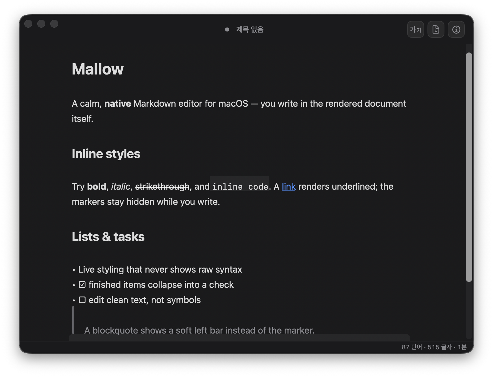

# Mallow

**A calm, native Markdown editor for macOS.** You write in the rendered document itself — no split raw/preview pane, no toolbar clutter, no settings to wade through. It follows your system light/dark appearance, keeps each note as a plain `.md` file on your disk, and stays out of your way.

Mallow is for people who just want to *write*. It deliberately isn't a note database, a wiki, or a plugin platform — it's a focused editor that does the writing essentials beautifully and stops there.



## Why Mallow

- **Markdown is the source of truth — but its syntax never shows.** You edit clean, styled text; the `#`, `**`, `*`, `` ` ``, `>` and list markers always collapse away (structure is changed from the Style menu and shortcuts, not by typing raw symbols). What you see is the document, not its markup.
- **Genuinely minimal — no settings screen.** Sensible defaults, zero configuration. It looks the way it should the moment you open it.
- **Distraction-free by design.** Focus Mode dims everything but the block you're on; Typewriter Scrolling keeps that line centered. The chrome fades while you write.
- **First-class Korean, Japanese & English.** The editor uses the macOS system IME directly, so Hangul/Kana composition is exactly as smooth as in any native app — and the UI follows your device language.
- **Your files, your disk.** One note = one `.md` file. No account, no cloud lock-in, no proprietary format. Point it at an iCloud or Dropbox folder if you want sync — that's it.
- **Truly native.** Not a web view in a window — a real macOS app with native menus, dialogs, and `.md` file associations.

## Features

- **Live-preview editing** — Mallow parses your markdown as you type; headings, bold/italic/strike/inline-code, links, lists, quotes, tables, task checkboxes, and code blocks are styled in place while the syntax markers stay hidden.
- **Format commands** — the full Format menu (bold/italic/strikethrough/inline-code ⌘B/⌘I, headings ⌘1–3 / body ⌘0, bullet & numbered lists, quote, code block, divider), plus a Style popover.
- **GFM tables & task lists** — tables render on a tidy card; `- [ ]` / `- [x]` show as ☐ / ☑ and toggle on click.
- **Focus Mode** (⌃⌘F) — dims every block but the caret's. **Typewriter Scrolling** (⌃⌘T) keeps the active line centered.
- **Multiple windows** — New (⌘N) and Open (⌘O / Recent / Finder double-click) open a separate document window; ⌘W closes one and the app quits after the last.
- **Files** — open / save / save-as with atomic writes and per-window dirty tracking (● in the title); debounced autosave once a document has a file; a discard prompt guards close (⌘W) and quit (⌘Q); external-change reload when you return from editing the file elsewhere; Open Recent and last-session restore (window size/position included).
- **Find & Replace** (⌘F) — the native find bar with match highlighting and replace.
- **Smart typography** — curly quotes, en/em dashes, and ellipsis as you type, kept out of code and never touching Hangul/Kana.
- **Statistics & Table of Contents** (⇧⌘I) — word / character / paragraph counts and read time, a click-to-jump TOC, and a live word-count badge in the status bar.
- **Export** — **HTML** (⇧⌘E) saves a self-contained, styled page (math renders as native MathML); **PDF** exports a clean light-theme document. **Copy as Rich Text** (⌥⌘C) keeps headings/bold/lists/tables/code when pasting into Slack, email, Docs, or Notion; **Paste & Match Style** (⇧⌘V) pastes plain text; pasting an http(s) URL over a selection wraps it in a link.
- **Text zoom** (⌘+ / ⌘− / ⌘0) and **Keep on Top** (View ▸ Keep on Top) — both per-window, reset each launch.
- **Automatic light & dark theme** — follows the macOS appearance and switches live, with the system fonts.

> Markdown math is kept as source text in the editor (it renders as MathML in HTML export).

## Install

Download the latest **`Mallow_<version>_aarch64.dmg`** from the [Releases](../../releases/latest) page (Apple Silicon), open it, and drag **Mallow** into **Applications**.

The build isn't code-signed yet, so on first launch macOS Gatekeeper will block a normal double-click. To open it once: right-click `Mallow.app` → **Open** → **Open**. Or from Terminal: `xattr -dr com.apple.quarantine /Applications/Mallow.app`.

## Building from source

macOS 14+. Mallow builds against a small companion engine checked out as a sibling at `../inkstone`; with that in place:

```sh
./build.sh        # build + run
./build-app.sh    # package an (unsigned) .app bundle → .build/Mallow.app
```

## Status

The macOS app is the current and only build; the earlier web-view build has been superseded and archived locally (not tracked in git). Code signing / notarization for distributable releases is the remaining packaging step.

## License

MIT — see [LICENSE](LICENSE).
