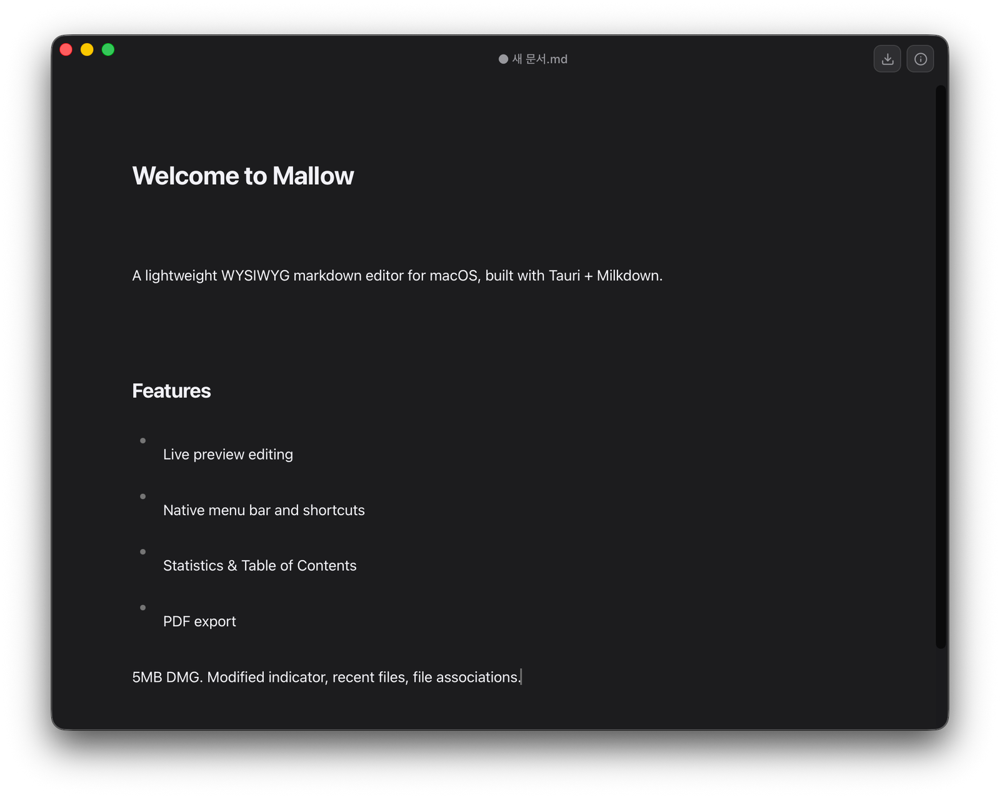

# Mallow

**A calm, native Markdown editor for macOS.** You write in the rendered document itself — no split raw/preview pane, no toolbar clutter, no settings to wade through. It follows your system light/dark appearance, keeps each note as a plain `.md` file on your disk, and stays out of your way.

Mallow is for people who just want to *write*. It deliberately isn't a note database, a wiki, or a plugin platform — it's a focused editor that does the writing essentials beautifully and stops there.



## Why Mallow

- **Genuinely minimal — no settings screen.** Sensible defaults, zero configuration. It looks the way it should the moment you open it.
- **Distraction-free by design.** Focus Mode dims everything but the line you're on; Typewriter Scrolling keeps that line centered. The chrome fades while you write.
- **First-class Korean, Japanese & English.** Most minimal editors are English-first. Mallow's entire UI is localized to your device language, and the writing features are built for CJK too — correct word counts for spaceless Japanese/Chinese, IME-safe typewriter scrolling, and smart typography that never touches your Hangul or Kana.
- **Your files, your disk.** One note = one `.md` file. No account, no cloud lock-in, no proprietary format. Point it at an iCloud or Dropbox folder if you want sync — that's it.
- **Native and tiny.** A real macOS app (native menus, dialogs, file associations) in a ~5 MB download, built on Tauri + a WKWebView — not a bundled browser.

## Features

- **Live preview editing** — type and edit markdown right inside the rendered view
- **Tables, math, code & task lists** — GFM tables, LaTeX math, fenced code blocks with syntax highlighting, and ☑ task checkboxes, all edited inline
- **Distraction-free writing** — Focus Mode (⇧⌘F) dims everything but the current paragraph; Typewriter Scrolling (⌃⌘T) keeps the active line centered. Both reliable in Korean/Japanese.
- **Smart typography & spell check** — curly quotes, en/em dashes, and ellipsis as you type (kept out of code), plus the macOS system spell checker
- **Find & Replace** (⌘F) — live match highlighting, a match counter, jump between matches, replace one or all, and an optional case-sensitive mode
- **Paste & drop images** — paste an image from the clipboard or drag an image file into the editor; it's embedded inline so the document stays self-contained
- **Localized UI (Korean / English / Japanese)** — the whole interface (menu, dialogs, tooltips, panels, dates) follows the device language and shows a single consistent language; any other language falls back to English
- **Multiple windows** — New (⌘N) and Open (⌘O / Recent / Finder double-click) open in a separate window instead of replacing the current document
- **Native macOS chrome** — standard menu bar (File / Edit / View / Window), ⌘N / ⌘O / ⌘S / ⇧⌘S / ⌘E / ⌘W shortcuts, file associations for `.md`
- **Modified indicator** — unsaved changes show as ● in the window title (macOS standard)
- **Autosave** — once a document has been saved to a file, edits are written to disk automatically a moment after you stop typing
- **External-change reload** — edit a file in another app and Mallow refreshes from disk when you return (it asks first if you have unsaved edits)
- **Recent files** — File → Open Recent (persisted across sessions)
- **Session restore** — reopens your last document and remembers the window's size and position across launches
- **Statistics & Table of Contents** — word/character/paragraph count, read time, and a collapsible TOC (⌘⇧I) with click-to-jump, plus a live word-count badge that also counts the current selection
- **PDF export** — quick export to a clean light-theme PDF
- **Export as HTML** (⇧⌘E) — save a self-contained, styled HTML file you can open in any browser (math renders as native MathML; tables and lists come out clean)
- **Copy as Rich Text** (⌥⌘C) — copy the document as formatted rich text, so pasting into Slack, email, Google Docs, or Notion keeps your headings, bold, lists, tables, and code; plain-text targets receive the markdown source
- **Automatic light & dark theme** — follows your macOS appearance and switches live when you change it, with system fonts (SF Pro + Apple SD Gothic Neo)

## Download & first launch

1. Download the latest `Mallow_<version>_aarch64.dmg` from the [Releases](../../releases) page.
2. Open the DMG and drag **Mallow** into your **Applications** folder.
3. **First launch (important):** the app is not yet code-signed with an Apple Developer ID, so macOS Gatekeeper will refuse to open it on a normal double-click ("Mallow can't be opened because Apple cannot check it for malicious software"). To get past this **once**:
   - **Right-click** (or Control-click) `Mallow.app` → choose **Open** → in the dialog, click **Open** again.
   - *Or:* try to open it once, then go to **System Settings → Privacy & Security**, scroll to the message about Mallow, and click **Open Anyway**.
   - *Or, from Terminal* — remove the quarantine flag macOS attaches to downloaded apps:
     ```bash
     xattr -dr com.apple.quarantine /Applications/Mallow.app
     ```
     `-d` deletes the `com.apple.quarantine` attribute; `-r` applies it recursively through the whole app bundle. If you get a permission error, prefix the command with `sudo`.
4. After this first time, Mallow opens normally with a regular double-click.

> This step is only needed because the build is unsigned — it is not a sign of anything wrong with the app. Signing & notarization are planned so future builds open without the prompt.

> **Apple Silicon only.** The released DMG targets `aarch64-apple-darwin` (M1/M2/M3/M4).

## Philosophy

Mallow grows by *sharpening what it is*, not by accumulating everything users might ask for. Some popular features are intentionally **out of scope**, because adding them would trade away the calm, single-file simplicity that is the point:

- **No plugin system, no marketplace** — the curated defaults are the product.
- **No accounts or built-in cloud sync** — your files are plain `.md`; a synced folder (iCloud/Dropbox) already does this.
- **No wiki-links / backlinks / tags / graph** — Mallow edits a document, it isn't a knowledge base. (Use Obsidian/Logseq for that.)
- **No settings sprawl** — preferences that would need a settings screen are answered with a good default instead.

If a change makes Mallow calmer to write in, it belongs. If it adds chrome or configuration, it probably doesn't.

## Development

```bash
npm install
npm run tauri dev    # or: npx tauri dev
```

## Build

```bash
npm run tauri build
```

Artifacts:

- `src-tauri/target/release/bundle/macos/Mallow.app`
- `src-tauri/target/release/bundle/dmg/Mallow_<version>_aarch64.dmg`

## Tech stack

- **[Tauri 2](https://tauri.app/)** — Rust + macOS WKWebView shell (small binary, native menus & dialogs)
- **[Milkdown (crepe)](https://milkdown.dev/)** — ProseMirror-based WYSIWYG markdown editor
- **TypeScript + Vite** — frontend
- **html2pdf.js** — client-side PDF export

## Architecture

The frontend is split by responsibility (Document + UIState as the only state holders; views are stateless):

```
src/
├── main.ts            # composition root
├── i18n/              # typed t() helper + locales/{en,ko,ja}.json (shared with the Rust menu)
├── domain/            # EventEmitter, Document, UIState
├── editor/            # EditorController (Milkdown wrapping)
├── services/          # FileService, PdfExporter, RecentFilesStore, MenuBridge, …
├── ui/                # TitleBarView, FilenamePopover, InfoPopover, StylePopover (stateless)
└── analysis/          # StatsCalculator, TocExtractor
```

## Localization

UI strings live in `src/i18n/locales/{en,ko,ja}.json` as the single source of truth.
The TypeScript frontend reads them through a typed `t()` helper, and the Rust native
menu embeds the same files at build time (`include_str!`), so there is one place to edit.
The device language is detected once in Rust (`sys-locale`) and shared with the frontend,
so the entire app — including macOS-injected menu items (via `CFBundleLocalizations`) —
renders in one consistent language: Korean, Japanese, or English (others fall back to English).

## License

MIT — see [LICENSE](LICENSE).
