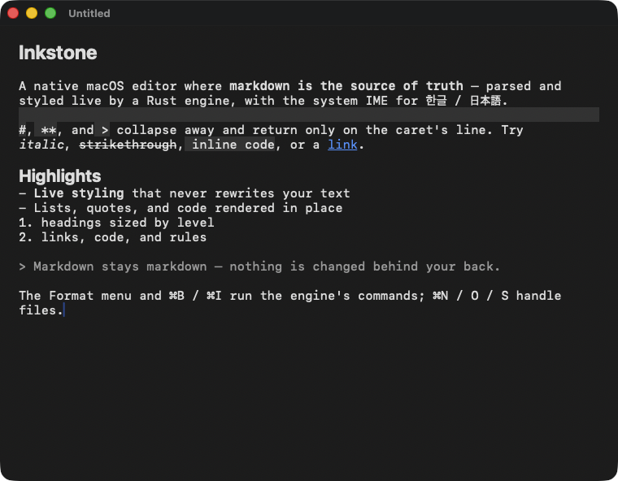

# Mallow — native macOS app

The native Swift/AppKit Mallow app, built on the [Inkstone](https://github.com/gurumdeva/inkstone)
engine (a markdown-as-truth Rust core, linked as a C-ABI staticlib). This is the successor to the
Tauri/Milkdown app in [`../src`](../src) + [`../src-tauri`](../src-tauri): it removes the WKWebView
and uses the OS system IME via `NSTextView`. macOS only.

## Engine dependency (sibling checkout)
The Rust engine lives in a separate repo and must be checked out as a **sibling** of this one:

```
Documents/
  inkstone/          # the engine (private: gurumdeva/inkstone)
  markdown-editor/   # this repo (Mallow)
    native/          # ← you are here
```

`Package.swift` links `../../inkstone/target/release/libinkstone.a`, and
`Sources/CInkstone/inkstone.h` symlinks `../../inkstone/include/inkstone.h`. Set the engine up
first (its README has details).

## Build & run
```sh
native/build.sh                       # builds the engine staticlib, then runs the app
# or manually, from native/:
( cd ../../inkstone && cargo build --features ffi --release )
swift build && swift run Mallow
```

## What's here
- **`Sources/Mallow/main.swift`** — the editor: native `NSTextView` (→ system IME),
  hide-syntax-at-caret live preview driven by Inkstone's parse, the full command set (Format menu),
  focus mode (View ▸ Focus Mode, ⌃⌘F), the native find bar (⌘F), and file I/O whose dirty tracking
  is Inkstone's verified `safety`.
- **`Sources/CInkstone/`** — the Inkstone C-ABI as a SwiftPM `systemLibrary` (module map + a symlink
  to the engine header).



## Status
The render is verified (see the capture above); interaction (IME typing, caret-move re-reveal,
command execution, file dialogs, focus toggle) needs a human at the keyboard — tracked in
`PENDING-MANUAL-TEST.local.md` (gitignored). The remaining build-out toward Tauri parity:
multi-window, export (render HTML from Inkstone's parse), recent files, and the rest of the
Tauri app's feature set.
